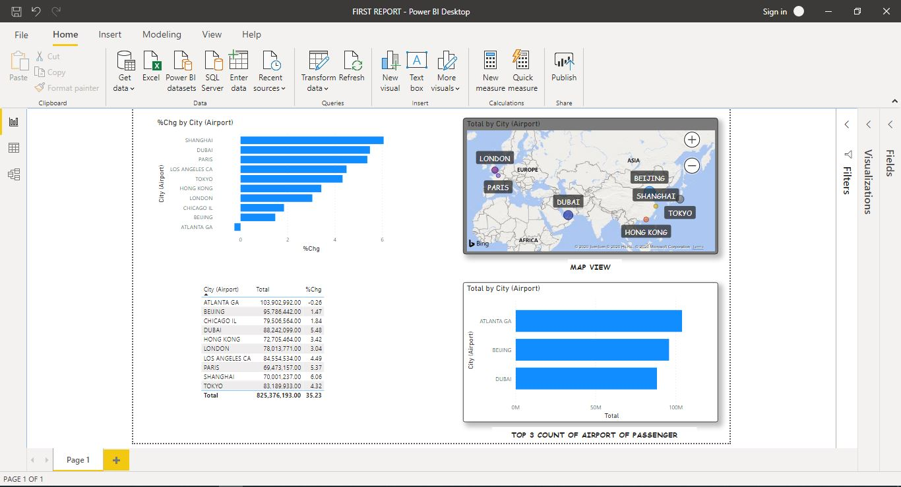

# Project 1 : Airport Passenger Report Dashboard.

> Every year lot number of people travelles from one place to another place. But do you know the year 2017 is marked as one of the year with thousands of people took more international flights than domestic flight. So here is my report dashboard that will list the top 10 countries with number of passengers. I will also list down the top 3 among those also. 

**Below is my snapshot of powerBI dashboard.**
<p align="center">
  
</p>

##### What have I used in this report?

Particulars|Reason
-----------|----------------
Clustered Column Chart | Showing a change of rate of passengers from country to country
Map view | Providing a world map where the top 10 countries are maked with differnt coloured bubbles
Table | A typical row and column view providing you the all records in a tabular format
Stacked Bar Chart | Representation of top 3 countries with most number of passenger travelling

***Data Source***
```
https://aci.aero/data-centre/monthly-traffic-data/passenger-summary/year-2017/12-months/

```

***Steps for Data Transform***
```
1.Select Table 1 from the list
2. Delete fitsr column i.e serial number column
3. Since the City(Airport) column names need to have some transformation as it contains city name with country name
4. Use Extract tool from Transform Tab and select *Left Text From Delimiter* and provide delimiter as *comma symbol(,)*
5. You will find that passenger number has some sapces in between.
6. Select Replace property and provide replace with value as *one space* and click ok.
7. Change the format to decimal numbers.
8. Click save and close.
```

***Steps for Visual Transform***
```
1. Select Clustered Column Chart and bring country and %chge column to it
2. Select Map View and Select City(Airport) as location and total column in size tab.
3. Select Table chart and bring all the column to it. i.e City(Airport), Total and %chge
4. Select Stacked bar chart and provide city(airport) a filter of top N wher N is 3 and data to the selected for compariosn is total
```

***Lastly save this report and provide some meaninful text box for better readabiliy.***

### I have also attached my report file you can download and have a look at it!

Have some questions :question: I am open to answer @PowerBiLearner :+1:
